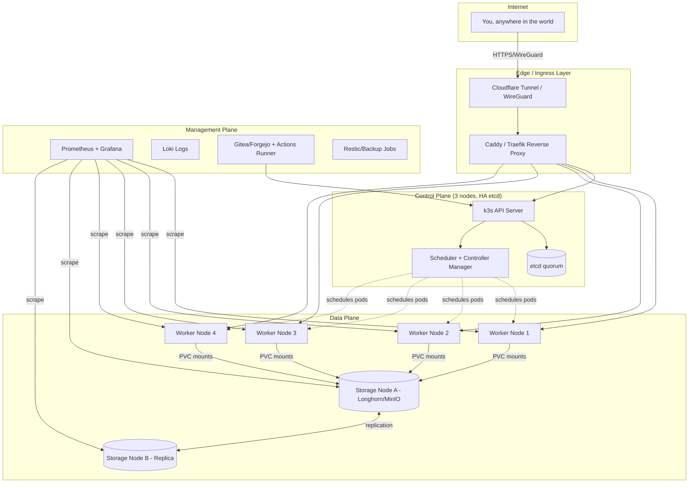
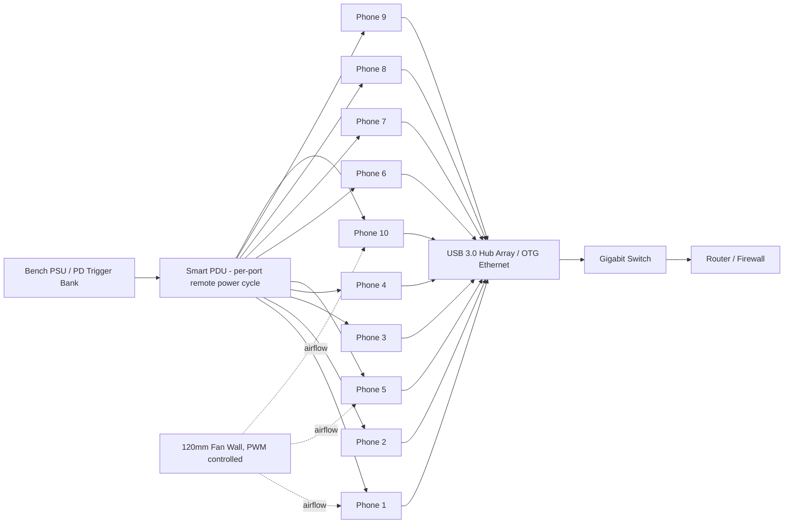
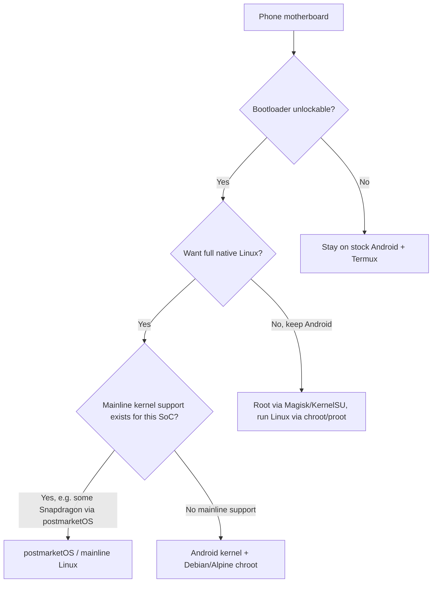
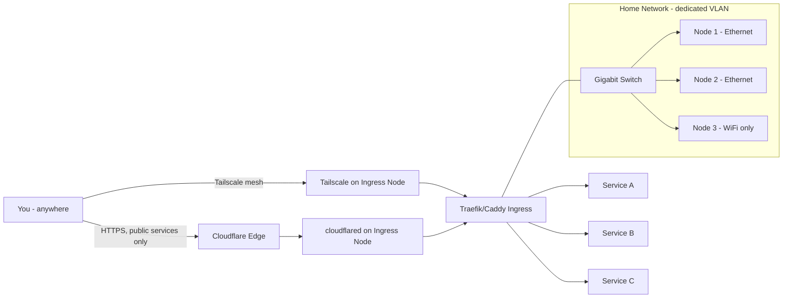
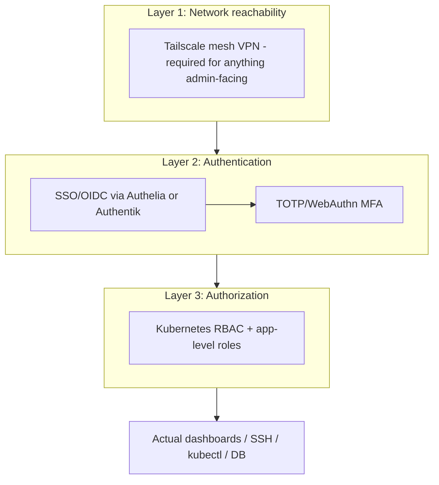

# The Phone-Cluster Cloud: Engineering a Self-Hosted Platform from Ten Discarded Android Motherboards

> A production-oriented feasibility study, architecture, and implementation blueprint for converting heterogeneous salvaged Android smartphone motherboards into a self-hosted, highly-available application and data platform — with remote access from anywhere in the world.

---

## Part 1 — Feasibility Analysis

### 1.1 The honest answer up front

Yes, this is buildable, and people have built versions of it — but "production-grade" needs a precise definition before we can say it's achievable. A cluster of ten 4 GB Android motherboards with no batteries and no displays is, physically, ten small ARM Linux-capable computers with roughly the horsepower of 2016-era budget phones. That is a real, useful amount of compute — comparable to 3-4 Raspberry Pi 4 boards in aggregate RAM, with more CPU cores in total but weaker per-core performance and much weaker I/O (phone eMMC/UFS storage, phone WiFi chipsets, no real Ethernet).

What is realistic: a always-on home lab that reliably runs dozens of small containerized services, a handful of low-traffic production workloads (personal SaaS tools, Git server, small databases, monitoring, static/dynamic websites for low request volumes, automation/bots, a self-hosted PaaS-like deploy flow), with genuine high availability for stateless services and best-effort HA for stateful ones.

What is not realistic: treating this as a drop-in replacement for AWS/GCP/Render at any meaningful scale, hosting anything with hard latency/availability SLAs for external paying customers, heavy AI training, high-throughput video transcoding at scale, or anything requiring ECC RAM, redundant PSUs, and hot-swap enterprise storage.

### 1.2 Production readiness — a graded scale

| Tier | Definition | Achievable here? |
|---|---|---|
| Tier 0 — Hobby | Works most of the time, manual recovery acceptable | Yes, trivially |
| Tier 1 — Home Production | Auto-restarts, monitored, backed up, acceptable for personal/small-team use | Yes, with the design in this document |
| Tier 2 — Small Business Production | SLA-aware, on-call alerting, tested DR, redundant network/power | Partially — network and power can be made redundant; storage and single points of failure in a 10-phone cluster cannot fully match this tier |
| Tier 3 — Enterprise / Hyperscale | Multi-region, ECC memory, enterprise NVMe, 5-nines | Not achievable with this hardware, full stop |

This document targets **Tier 1, reaching toward Tier 2** for the control plane and stateless workloads specifically.

### 1.3 What can realistically be hosted

- Personal websites, blogs, static sites, small Next.js/Django/Flask apps
- Internal developer tools, dashboards, N8N/automation flows
- Git hosting (Forgejo/Gitea), CI runners for small projects
- A self-hosted PaaS ("git push to deploy") for personal/side projects
- Small-to-medium databases (PostgreSQL/MariaDB/Redis) for low-to-moderate QPS
- Monitoring/observability stack for the cluster itself and other home devices
- Home Assistant, Uptime Kuma, Vaultwarden, Nextcloud (light use), Immich (light use), a Matrix homeserver for a handful of users
- Object storage (MinIO) for backups and personal files
- Lightweight game servers (Minecraft with few players, Factorio)
- Small LLM inference is possible only for tiny quantized models (see Part 16); this is not viable for serious LLM hosting

### 1.4 Where the hard limitations are

1. **Storage I/O ceiling.** Phone eMMC/UFS storage was designed for bursty personal use, not sustained database writes. Random 4K write IOPS on old phone storage is a fraction of even a cheap NVMe SSD.
2. **No ECC RAM.** Silent bit-flips are a real (if statistically rare) risk for anything storing important data over years.
3. **Thermal headroom.** Phone SoCs throttle aggressively without their original chassis + thermal paste + sometimes vapor chamber. Bare boards without directed airflow will throttle under sustained load.
4. **WiFi as the primary network fabric.** Even with an OTG Ethernet adapter per phone (recommended, see Part 6), you're still bound by USB 2.0 speeds (~35-40 MB/s realistic) on most of these boards unless a phone specifically exposes USB 3.
5. **Heterogeneity tax.** Every extra dimension of hardware difference (SoC vendor, kernel version, Android version, bootloader lock state) adds real engineering and maintenance overhead. This is the single biggest "hidden cost" of the whole project.
6. **Bootloader locking.** On some devices you cannot legally/technically unlock the bootloader (carrier-locked, OEM-locked past unlock window, Knox-tripped Samsung devices, etc.). This can force a device down the "rootless Termux" path instead of the "native Linux" path, and that changes its role in the cluster (see Part 3).
7. **No native hot-swap.** If a board dies, someone has to physically walk over, unplug it, and reflash a replacement — there is no remote hands service.

### 1.5 Assumptions from the brief — reality check

| Assumption | Realistic? | Notes |
|---|---|---|
| Every motherboard boots correctly | Realistic, but expect 1-2 in 10 to have a marginal fault (bad WiFi, bad USB port, swollen-battery-connector damage) discovered during bring-up | 
| USB debugging enabled | Realistic if you had access to the phones before wipe; otherwise requires OEM unlock via settings first, which may need a working touchscreen — plan for a "donor screen" you temporarily attach |
| Bootloader status may vary | Very realistic — expect a genuine mix; design the architecture (Part 5) to tolerate this, not fight it |
| "No displays, no batteries" | Fine electrically for most Qualcomm/MediaTek boards if power is injected correctly at the battery connector or via a boost board — but this is the single riskiest hardware step in the whole project (Part 2.7) |
| Centralized, professional power delivery | This is the correct call and effectively mandatory for safety — see Part 2.7 |
| "Behave like one large server" | Achievable as a *logical* abstraction via Kubernetes/Nomad + a PaaS layer on top — not achievable as literal SMP (you cannot merge 10 boards into one shared-memory machine) |

### 1.6 The core engineering thesis of this document

We are not building one computer. We are building a **distributed system** that presents a single control-plane API and a single deploy experience, orchestrating many small, unreliable, heterogeneous nodes — which is exactly the problem Kubernetes, Nomad, and the whole cloud-native ecosystem were built to solve. That reframing is what makes the project tractable: every part below borrows deliberately from data-center distributed-systems practice, scaled down.

---

## Part 2 — System Architecture

### 2.1 Design philosophy

Three planes, borrowed from telecom/cloud architecture, keep the system reasoned-about-able:

- **Control plane** — the brains: scheduling, service discovery, secrets, API, dashboard.
- **Data plane** — the muscle: your actual containers/workloads, and the storage/network they use.
- **Management plane** — the eyes and hands: monitoring, logging, backups, remote access, CI/CD.

Every one of the 10 boards is assigned a **role**, not treated identically. Heterogeneity is handled by *specialization*, not by pretending the boards are equal.

### 2.2 Node role assignment (recommended for 10 phones)

| Role | Count | Requirements | Notes |
|---|---|---|---|
| Control-plane node (etcd + API server) | 3 | Most stable board, unlockable bootloader, best storage | Odd number for etcd quorum |
| General worker | 4 | Any unlockable board | Runs stateless app containers |
| Storage node | 2 | Largest/healthiest storage, best thermal | Runs Longhorn/MinIO/NFS |
| Ingress/edge node | 1 | Best network chipset, most stable uptime | Runs reverse proxy, WireGuard, tunnel client |

If fewer than 3 boards can be safely unlocked for a real Linux/K3s install, fall back to a **1 control-plane + N worker** k3s topology (still valid, just without control-plane HA) and put unrootable phones to work as **Termux-based worker agents** or pure storage/network appliances instead (Part 3, Part 4).

### 2.3 High-level architecture diagram



### 2.4 Control plane

Runs **k3s** (lightweight Kubernetes, single binary, ~512 MB RAM footprint — critical given only 4 GB per node) in embedded-etcd HA mode across 3 nodes. This gives you: the Kubernetes API, a scheduler that already understands heterogeneous resource requests (via `resources.requests`/`limits` and node labels), and a huge ecosystem of tooling that a hand-rolled scheduler would take months to replicate.

### 2.5 Data plane

Everything user-facing runs as Kubernetes workloads: Deployments (stateless), StatefulSets (databases, storage), DaemonSets (monitoring agents on every node), CronJobs (backups, maintenance). Node **labels and taints** encode the heterogeneity: `storage-node=true`, `arch=arm64`, `thermal-class=weak`, so the scheduler naturally places the right workload on the right board.

### 2.6 Management plane

Prometheus + Grafana + Loki for observability, Gitea/Forgejo + Actions runner for CI/CD, Restic for encrypted off-node backups, and Uptime Kuma as a simple external-feeling status page. This plane is what turns "a pile of containers" into something you can actually operate and trust.

### 2.7 Power delivery (the part the brief is right to centralize)

This is the most safety-critical hardware decision in the project.

- **Never reuse the original lithium battery.** Boards are typically brought up either by bridging the battery connector to a regulated 3.7-4.35V rail (board-specific, risky, requires knowing the exact PMIC behavior) or — the safer and far more common community approach — using a **breakout/test-point board or a "boost board"** designed for the specific SoC family (e.g., many Qualcomm boards can be brought up via a lab bench supply at the battery connector with current limiting) or via a dedicated **USB-PD triggered bench supply** feeding the correct rail.
- Centralize on a single **bench-style DC power supply (adjustable, current-limited, 0-5A per channel)** or a bank of **USB-PD "trigger boards"** feeding each phone's charging IC (many boards will actually power up and charge/boot from their stock USB-C/micro-USB charging port even without a battery, if the PMIC is tolerant of no-battery operation — verify per-model, some PMICs refuse to boot with zero battery detected, in which case a "battery simulator" — a supercap or a dummy battery jig with the correct ID resistor — is required).
> [!DANGER] Highest-risk step in the whole build
> Bridging power directly to a phone's battery connector without knowing that exact board's PMIC behavior can destroy the board or, in the worst case, start a fire. Always current-limit the supply, verify polarity twice, and prefer a documented boost/trigger board over a bare wire bridge. When in doubt, power via the stock charging port instead of the battery connector.

- Add a **master relay/smart PDU** (e.g., a Shelly or Tasmota-based smart plug strip, or a proper 12-outlet managed PDU) so you can remotely power-cycle any single board — this is your only "remote hands" for a hung board.
- Fuse every rail. A shorted phone board on an unfused high-current bench supply is a fire risk.

### 2.8 Physical layout diagram



### 2.9 Authentication, security, recovery, scaling, automation — pointers

These are covered in depth in their own parts (Security → Part 14, Automation → Part 15, Failure/Recovery → Part 18, Future scaling → Part 19) so this architecture section stays focused on structure rather than duplicating content.

---

## Part 3 — Boot Process: Every Path to Linux Access

### 3.1 The core decision tree



### 3.2 Comparison table

| Approach | Root needed? | Bootloader unlock needed? | Perf overhead | HW compatibility | Maintenance burden | Best for |
|---|---|---|---|---|---|---|
| **Termux (no root)** | No | No | Low (userspace) | Universal — works on every phone | Low | Locked/unrootable phones; quick wins |
| **Termux + root (Magisk)** | Yes | Yes (usually) | Low | Wide | Medium | Phones you can unlock but don't want to reflash |
| **KernelSU** | Kernel-level root | Yes | Very low | Requires custom kernel build per device — much narrower than Magisk | High | Advanced users on well-supported devices |
| **proot-distro (Ubuntu/Debian/Alpine in Termux)** | No | No | Medium (syscall translation layer) | Universal | Low | Getting a "real" Linux userland without root |
| **chroot (rooted, real kernel namespaces)** | Yes | Yes | Low (near-native) | Wide | Medium | Rooted phones needing Docker-like isolation |
| **postmarketOS (mainline or downstream kernel)** | N/A (replaces OS) | Yes, full unlock + reflash | Low | Narrow — only devices with mainline or postmarketOS-maintained kernels | High (device bring-up) | The 1-3 best-supported phones in your batch |
| **Custom/mainline Linux (pure, no Android at all)** | N/A | Yes | Lowest | Narrowest — realistically only a few flagship SoCs (some Snapdragon 8xx era, some older devices with community mainlining projects) | Very high | Enthusiast bring-up on 1 "hero" device |
| **Buildroot / Alpine / Debian ARM (as the postmarketOS userland)** | N/A | Same as above | Low | Same as above | Medium once booted | Minimal-footprint server rootfs |

### 3.3 Recommended strategy for a 10-phone batch

Realistically, across 10 random discarded phones from different brands, expect:

- **2-4 phones**: unlockable bootloader, decent community ROM/kernel support → install **postmarketOS** or a lightweight custom Android build stripped to a headless service (or root + chroot Debian) and run **k3s natively**. These become your control-plane and storage nodes.
- **3-5 phones**: unlockable but no mainline Linux support → **root via Magisk, run a Debian/Alpine chroot with real kernel namespaces**, install a container runtime inside. These become general workers.
- **1-3 phones**: locked bootloader, no root possible → **stock Android + Termux (no root)**, running as lightweight worker agents (a Termux-hosted agent process, or Docker-less workloads via `proot` for isolation-light tasks like static file serving, cron jobs, or a message queue consumer).

This mirrors exactly the "specialize by capability" principle from Part 2 — don't try to force every phone through the same pipeline.

### 3.4 Why not "just root everything"?

Because you can't, safely, in every case. Carrier-locked and OEM-locked-past-window devices (common on US carrier phones, some Samsung devices after Knox trips a permanent fuse) genuinely cannot be unlocked without either exploiting a signed firmware vulnerability (unreliable, device- and patch-level-specific, and increasingly rare as OEMs patch these) or accepting permanent loss of some hardware features (Samsung Knox-based features, SafetyNet/Play Integrity for anything relying on it). Designing the architecture to tolerate a mix (Part 3.3) is strictly better engineering than assuming uniform root access.

---

## Part 4 — Termux Deep Dive

### 4.1 Can Termux be a permanent server environment?

Yes, with caveats, and it is genuinely the right tool for the unrootable phones in your batch. Termux gives you a real `bash`/`zsh` shell, `apt`-style package management (`pkg`), OpenSSH, Python, Node.js, Go, and most standard Unix tooling, all running as a normal unprivileged Android app — no root required.

### 4.2 What works well long-term

- **SSH server** (`sshd` via `openssh` package) — rock solid, this is your primary remote access into a Termux node.
- **Package management** — Termux's own repo (`pkg install`) covers the vast majority of CLI tooling you'd want; `pip`/`npm`/`go` work normally inside it.
- **Long-running processes** — as long as Android doesn't kill the app.
- **Cron-like scheduling** — via `cronie` (needs a persistent Termux session) or, more reliably, `termux-job-scheduler` / `termux-services` (a `runit`-based service supervisor made specifically for this).
- **`termux-services`** — the closest thing to a systemd alternative in Termux; runit-based, supports enable/disable/restart of long-running daemons cleanly.

### 4.3 The core limitation: Android's process killer

Android aggressively kills background processes to save battery. Since these are headless boards with no battery to save, you disable this at the source:

1. Acquire a **wake lock**: `termux-wake-lock` (from the `termux-api` package) prevents Android from doky-sleeping the CPU while Termux is active.
2. Disable battery optimization for the Termux app in Android settings (`Settings → Apps → Termux → Battery → Unrestricted`).
3. On MIUI/ColorOS/other heavily-customized OEM skins, there is usually a *second*, OEM-specific battery/"autostart" killer that must also be disabled — this is one of the more annoying heterogeneity taxes described in Part 1.5.
4. Use `termux-boot` (a companion Termux add-on app) to auto-start Termux and your services on device boot, so a power cycle recovers automatically.

### 4.4 Container support inside Termux

Docker itself does **not** run inside unrooted Termux (it needs kernel features — cgroups, overlayfs — that require root or a real Linux kernel namespace, not just userspace). Two workable alternatives:

- **`proot-distro`**: run a full Debian/Ubuntu/Alpine rootfs inside Termux via `proot` (syscall-level emulation, no root, no real namespace isolation — think "chroot-like" but slower and without hard isolation). Fine for running services, not a real security boundary between workloads.
- **`podman` in rootless mode**: possible on **rooted** Termux/devices with a compatible kernel (needs user namespaces enabled in-kernel), giving real container isolation. Not available on stock unrooted Android kernels in most cases.

Practical conclusion: **unrooted Termux nodes are not container hosts** — they run plain processes (a Python/Node/Go binary, a static file server, an SSH-reachable worker agent) directly, supervised by `termux-services`. Rooted Termux nodes with a permissive kernel can attempt rootless Podman.

### 4.5 Networking and SSH

`sshd` on a non-privileged port (Termux can't bind port 22 without root; use 8022, the default) works well as the transport for both remote administration and for these nodes to receive lightweight work (e.g., an agent polling a queue, or files pushed via `rsync`/`scp`).

### 4.6 Long-term stability verdict

For Tier-1 home production (Part 1.2), Termux nodes are reliable **for stateless, restart-tolerant workloads** — a monitoring exporter, a queue worker, a static asset server, a Syncthing node. They are not reliable enough, and not architecturally suited, to run your database or control plane. Treat every Termux node as ephemeral/replaceable, exactly like a Kubernetes pod on a spot instance — and design workloads accordingly (idempotent, stateless, quick to restart elsewhere).

---

## Part 5 — Heterogeneous Cluster Design

### 5.1 The principle: label everything, assume nothing is equal

Kubernetes (via k3s) already has the primitives for this — you just have to actually use them, rather than treating all nodes as interchangeable:

```yaml
# Example node labels applied at join time or via kubectl label
apiVersion: v1
kind: Node
metadata:
  name: phone-07
  labels:
    hardware/arch: arm64
    hardware/ram-class: "4gb"
    hardware/thermal-class: weak     # throttles under sustained load
    hardware/storage-class: emmc      # vs ufs
    hardware/wifi-only: "true"        # no ethernet adapter available
    role: worker
```

### 5.2 Handling different CPUs / ARM revisions

Almost all modern Android SoCs are **arm64 (aarch64)**, so most container images with `linux/arm64` support will run across the whole fleet. The real variance is in **ISA feature levels** (some older SoCs lack certain NEON/crypto extensions) which occasionally breaks a container built with aggressive compiler flags. Mitigation: build your own images with conservative `-march` targets, or rely on well-maintained upstream `arm64` images (Alpine, Debian-slim based) which are built conservatively by default.

### 5.3 Different RAM amounts

If all 10 phones genuinely have 4 GB, this axis is uniform in your specific batch — but the *usable* RAM differs because Android's own services (even trimmed) and different kernel versions have different baseline memory footprints. Solve with **Kubernetes resource `requests`/`limits`** per node reality, verified empirically (deploy a stress test, watch actual free RAM under load with `node_exporter`, set limits conservatively below that).

### 5.4 Different storage generations (eMMC vs UFS)

Label nodes by storage class and use Kubernetes **StorageClasses** to route different workloads: put databases and anything write-heavy on UFS-backed storage nodes (much better random IOPS), and put read-heavy/static content on eMMC nodes.

### 5.5 Different WiFi chipsets

Chipset variance mostly matters for **throughput and stability under many concurrent connections**, not correctness. Where possible, bypass WiFi entirely with USB-Ethernet adapters (Part 6) on the nodes doing the most network I/O (ingress, storage), and leave WiFi-only nodes for lighter, less network-hungry workloads — encode this as the `hardware/wifi-only` label and use it in scheduling.

### 5.6 Different kernel/Android versions

This affects which container features (cgroups v1 vs v2, certain seccomp profiles) are available. k3s and Docker both support the older cgroups v1 (most Android 10-based kernels are v1), so this is manageable but should be **tested per-node during bring-up**, not assumed.

### 5.7 Different thermal limits

This is the axis that most directly threatens reliability. Approach:

1. Run a sustained synthetic load test (e.g., `stress-ng`) on each board during bring-up, log core frequency over 30 minutes via `cat /sys/devices/system/cpu/cpu*/cpufreq/scaling_cur_freq`.
2. Classify each node `thermal-class: strong|moderate|weak` based on how much it throttles.
3. Use Kubernetes **taints** on weak-thermal nodes (`thermal=weak:PreferNoSchedule`) so the scheduler avoids placing CPU-heavy workloads there by default, while still allowing light workloads (an SSH-reachable Termux node, a lightweight exporter) to live there.
4. Physically address it: a directed fan wall (Part 2.8) fixes more of this problem than any amount of software scheduling cleverness.

### 5.8 Fair scheduling across unequal nodes

Kubernetes's default scheduler already bin-packs by **requested resources**, not node count — a node with less free RAM naturally receives fewer/smaller pods. The two changes that matter most for a heterogeneous fleet like this:

- Set **realistic, empirically-measured `requests`** per node (don't trust spec sheets; measure).
- Use **`PodTopologySpread`** constraints so replicas of the same service are spread across nodes of different thermal/storage classes, so a single node's slowness doesn't become a single point of failure for that service's latency.

> [!TIP] Measure, don't assume
> Every threshold in this document (thermal class, storage class, RAM headroom) should come from a real measurement on your actual boards, not from spec sheets. A stress-ng run and a week of Prometheus data will tell you more than any datasheet.

### 5.9 Heterogeneity summary table

| Axis | Risk if ignored | Mitigation |
|---|---|---|
| CPU/ISA | Container crashes with illegal instruction | Conservative build targets, arm64 upstream images |
| RAM | OOM-kills, node instability | Empirical `requests`/`limits`, per-node measurement |
| Storage generation | DB write stalls, corruption risk under load | StorageClass routing, dedicated storage nodes |
| WiFi chipset | Network flakiness, dropped connections | USB-Ethernet where possible, `wifi-only` label + light workloads |
| Kernel/Android version | cgroups/feature mismatch | Per-node bring-up testing, cgroups v1 compatibility |
| Thermal | Silent throttling, latency spikes | Taints, physical cooling, empirical thermal-class labels |

---

## Part 6 — Network Design

### 6.1 Topology comparison

| Option | Throughput | Reliability | Complexity | Verdict |
|---|---|---|---|---|
| WiFi only | Low-Medium (varies wildly by chipset) | Medium — subject to interference | Lowest | Fallback only, for the locked/Termux-only nodes |
| USB-OTG Ethernet adapter per phone | Medium (USB 2.0 ≈ 35-40MB/s realistic; USB3-capable boards much higher) | High | Low-Medium | **Recommended default for every unlockable node** |
| USB hub fan-out to a switch | Same as above, shared upstream bandwidth | High if hub is powered | Medium | Good for physically consolidating cabling |
| Mesh WiFi | Medium | Medium | Medium | Unnecessary at this scale, adds latency |
| Dedicated switch + router | High | High | Low | **Required regardless of the above** — the backbone |

### 6.2 Recommended physical network

Give every phone that supports USB OTG a **USB-C/micro-USB-to-Ethernet adapter**, run all of them into a **gigabit unmanaged or lightly-managed switch**, and keep WiFi only as a fallback for the 1-3 truly locked-down Termux-only nodes (which typically carry the least network-sensitive workloads anyway per Part 5.9).

### 6.3 Addressing and segmentation

- **Static IPs (or DHCP reservations keyed to MAC)** for every node — dynamic addressing makes a Kubernetes cluster fragile.
- A dedicated **VLAN** for the cluster, isolated from your general home network, with the router/firewall as the only bridge — limits blast radius if a container is ever compromised.
- **IPv6**: nice-to-have, not required at this scale; most home ISPs and the tooling (k3s, WireGuard, Cloudflare Tunnel) all work fine on IPv4-only.

### 6.4 Overlay networking (cluster-internal)

k3s ships with **Flannel** (simple, VXLAN-based) by default — sufficient here. If you outgrow it or want network policies, **Cilium** (eBPF-based) is the modern upgrade path, but adds real CPU overhead that these boards can't always spare — start with Flannel.

### 6.5 Remote access transport — comparison

| Technology | NAT traversal | Setup complexity | Performance | Best for |
|---|---|---|---|---|
| **WireGuard** (self-hosted) | Needs one port-forward or a relay | Low-Medium | Excellent (kernel-level) | Full private network access — your primary VPN |
| **Tailscale** (WireGuard-based, managed) | Automatic (DERP relays) | Very low | Excellent | Easiest zero-config mesh VPN, recommended default |
| **ZeroTier** | Automatic | Low | Very good | Similar to Tailscale, alternative if you prefer its model |
| **Cloudflare Tunnel** | Automatic, no open ports at all | Low | Good (HTTP/S-oriented) | Publishing specific web services publicly without exposing your home IP |
| **Reverse SSH tunnel** | Manual, needs a relay/jump host | Medium | Good for single services | Quick/manual fallback, not a full solution |
| **Static IP + port forward + own VPN server** | Manual | High | Excellent | Full control, more exposure/maintenance |
| **Dynamic DNS (DDNS)** | N/A (name resolution, not tunneling) | Low | N/A | Pairs with any of the above if you don't have a static IP |

### 6.6 Recommended stack

**Tailscale** for full private mesh access to every node (SSH, internal dashboards, kubectl) — because it just works through CGNAT (common on residential ISPs, and *especially* common in India, relevant to Part 7), plus **Cloudflare Tunnel** for the small number of services you want reachable without a VPN client (e.g., a public status page or a personal blog), fronted by **Traefik or Caddy** as the in-cluster reverse proxy/load balancer with automatic Let's Encrypt TLS.

> [!NOTE] CGNAT is the default assumption
> Design the remote-access layer (Part 7) assuming you do **not** have a public IP, even if you currently do. ISPs change NAT policies without notice, and a design that only works with a public IP is a design that will silently break someday.

### 6.7 Load balancing inside the cluster

k3s includes **ServiceLB** (a simple built-in load balancer) out of the box; **Traefik** (bundled with k3s by default) or **Caddy** (simpler config, excellent automatic HTTPS) handle L7 routing/ingress, path-based and host-based routing to your many small services.

### 6.8 Network architecture diagram



---

## Part 7 — Remote Access (Home in India, You in Russia)

### 7.1 The scenario in concrete terms

Your cluster sits behind a residential ISP router in India — very possibly behind **CGNAT** (extremely common with Indian ISPs, meaning you don't even have a real public IP to port-forward). You need SSH, the Kubernetes dashboard/`kubectl`, container logs, database access, monitoring, and file access, securely, from a hotel WiFi or SIM connection in Russia.

### 7.2 Why Tailscale/ZeroTier solve the CGNAT problem

Both use WireGuard-style encrypted tunnels with a coordination server that helps peers find each other and establishes **NAT hole-punching**, falling back to a relay if direct connection isn't possible — meaning it works **even with no port forwarding and no static IP**, which a raw self-hosted WireGuard server behind CGNAT genuinely cannot do without an intermediate relay of your own. This is the deciding factor for a CGNAT home connection.

### 7.3 What you get access to, concretely

| Need | Solution |
|---|---|
| SSH into any node | Tailscale SSH, or classic SSH over the Tailscale IP |
| `kubectl` / cluster admin | `kubectl` configured against the cluster's Tailscale IP, or a Tailscale-only-reachable dashboard (Headlamp/Rancher) |
| Container logs | Grafana Loki UI, reachable over Tailscale |
| Database access | `psql`/`mysql` client over Tailscale IP directly to the DB service, or a lightweight Adminer/pgAdmin instance, Tailscale-only |
| Deployments | `git push` to your self-hosted Gitea/Forgejo, reachable over Tailscale, triggers CI which deploys to the cluster |
| Monitoring | Grafana dashboard, Tailscale-only |
| Terminal | SSH, or a browser-based terminal (ttyd/Wetty) behind Tailscale + auth |
| Files | Syncthing (Part 9) or a Tailscale-only file browser (Filebrowser, or Nextcloud for richer needs) |

### 7.4 Layered access model



Nothing administrative should be reachable without **all three layers**: you must be on the Tailscale network, you must authenticate (ideally via **Authelia** or **Authentik** as a single sign-on gate in front of every internal dashboard, with **TOTP or WebAuthn/Passkey MFA**), and the identity you authenticate as must be authorized (Kubernetes **RBAC** roles, scoped per-tool) for the specific action.

### 7.5 Domain names and DNS

A cheap domain (Cloudflare registrar, Namecheap, etc.) pointed at Cloudflare's nameservers gives you: free automatic TLS certs via Let's Encrypt/Cloudflare, Cloudflare Tunnel for the handful of public-facing services, and clean subdomain-per-service organization (`git.example.com`, `grafana.example.com`, all Tailscale-gated except the ones you deliberately expose). You do **not** need Dynamic DNS if you're using Tailscale + Cloudflare Tunnel, since neither depends on knowing your home IP — this removes an entire historical failure mode (DDNS record going stale) from the design.

### 7.6 What happens if your home internet itself goes down while you're in Russia

This is a real failure mode with no perfect software fix — see Part 18 for the full failure-scenario treatment, but the short version: keep a **cheap LTE/5G failover router** (dual-WAN) at home so a fiber outage doesn't take the whole cluster off the internet, and keep **Uptime Kuma alerting to Telegram/Discord/email** so you know within a minute or two, rather than discovering it when you try to `kubectl get pods` from your hotel and get nothing.

---

## Part 8 — Cluster Management

### 8.1 Container runtime and orchestrator comparison

| Tool | RAM footprint | Fits 4GB nodes? | Orchestration | Verdict |
|---|---|---|---|---|
| Docker + Docker Swarm | Medium | Yes | Basic, built-in | Fine for a quick start, weaker ecosystem than k8s |
| Podman (rootless) | Low-Medium | Yes | None (needs external) | Good for rootful/rooted single-node testing |
| Containerd (bare) | Low | Yes | None (needs external) | This is what k3s uses under the hood already |
| LXC/LXD | Low | Yes | None (needs external) | System-container style, less app-container-native tooling |
| **Kubernetes (full/kubeadm)** | High (~2GB+ control plane) | Marginal on 4GB nodes | Full-featured | Too heavy for control-plane nodes here |
| **k3s** | Low (~512MB) | **Yes — recommended** | Full Kubernetes API, lightweight | **Best fit for this hardware** |
| MicroK8s | Medium | Borderline | Full Kubernetes API | Viable alternative to k3s, slightly heavier, Snap-based (adds complexity on ARM) |
| Nomad (HashiCorp) | Low | Yes | Simpler scheduler, less ecosystem | Good alternative if you want less complexity than k8s and don't need the full API surface |

**Recommendation: k3s**, for the reasons above — it is purpose-built for exactly this class of hardware (originally designed for edge/IoT/Raspberry Pi clusters, which is functionally the same problem as this project).

### 8.2 How many containers could realistically run

With 10 nodes × 4 GB RAM (40 GB total, realistically ~28-32 GB usable after OS/kernel/k3s overhead across all nodes), and typical small container workloads (50-250 MB each):

- **100-150 lightweight containers** (static sites, small APIs, exporters, workers) is a realistic sustained ceiling.
- **20-40 medium containers** (small databases, Node/Python apps with real memory use, ~300-500 MB each) is realistic if that's most of what you run.
- CPU, not RAM, is usually the first real bottleneck under actual traffic — expect CPU contention well before RAM exhaustion if several services get simultaneous load.

### 8.3 Scheduling, resource limits, rolling updates

Standard Kubernetes primitives apply directly: `resources.requests/limits` per container (mandatory here, not optional, given the tight RAM budget), `RollingUpdate` strategy (default) for zero-downtime deploys of stateless services, `PodDisruptionBudgets` to prevent a rolling update or node drain from taking out every replica of a service at once.

### 8.4 Autoscaling

Horizontal Pod Autoscaler (HPA) works, but with a *fixed* pool of 10 nodes there's a hard ceiling — autoscaling here is really about **efficient redistribution** of a fixed resource pool, not infinite elastic scale. Vertical scaling headroom is essentially zero (you can't add RAM to a phone board), so design services to scale horizontally (more small replicas) rather than expecting any single container to get bigger.

### 8.5 Service discovery

Built into Kubernetes via **CoreDNS** (bundled with k3s) — every Service gets a stable internal DNS name (`servicename.namespace.svc.cluster.local`) automatically; no extra tooling needed.

### 8.6 Persistent storage

Covered fully in Part 9, but the connecting piece here is the Kubernetes **CSI (Container Storage Interface)** driver for whichever storage backend you choose (Longhorn ships its own CSI driver, NFS uses the standard `nfs-subdir-external-provisioner`), which is what lets a StatefulSet's `PersistentVolumeClaim` actually land on the right storage node automatically.

---

## Part 9 — Distributed Storage

### 9.1 Options compared

| System | Type | Replication | RAM/CPU cost | Fit for this hardware |
|---|---|---|---|---|
| **NFS** (one storage node exports, others mount) | Network filesystem | None built-in (single point of failure unless paired with DRBD/replication) | Very low | Good simple starting point |
| **Longhorn** | Distributed block storage, k8s-native | Yes, built-in | Medium | **Recommended** — purpose-built for k3s edge clusters |
| **Ceph** | Distributed block/object/file | Yes, strong consistency | High — generally needs more RAM/CPU than these nodes comfortably offer | Technically possible on 1-2 beefier nodes only; not recommended fleet-wide |
| **GlusterFS** | Distributed file | Yes | Medium-High | Viable alternative to Longhorn, less k8s-native |
| **Syncthing** | P2P file sync (not a "real" distributed filesystem) | Eventually-consistent sync | Very low | Great for personal file sync, not for database-grade storage |
| **MinIO** | S3-compatible object storage | Yes (erasure coding across nodes) | Low-Medium | **Recommended** for object storage — backups, media, artifacts |

### 9.2 Recommended layering

- **Longhorn** for Kubernetes `PersistentVolumeClaim`-backed block storage (databases, app state) — replicate every volume **at least 2x** across your 2 dedicated storage nodes plus one general worker as a third replica target.
- **MinIO** (distributed mode across the same storage nodes) for S3-style object storage — this is what your backups (Restic can target S3), user uploads, and any "file storage" style app (Immich, Nextcloud) should use.
- **NFS** as a simple fallback/legacy mount for anything that just wants a POSIX filesystem and doesn't need HA (e.g., shared config directories).

### 9.3 Replication, backups, snapshots

Longhorn supports scheduled **snapshots** and **backups to an external target** (point it at your MinIO bucket) — set up a `RecurringJob` for nightly snapshots and weekly full backups off-cluster (ideally to a truly separate device, or cloud object storage like Backblaze B2, to survive a total local-site event like fire/theft).

> [!WARNING] Replication is not a backup
> Longhorn/MinIO replication protects against a single node failing. It does not protect against accidental deletion, a bad deploy that corrupts data, or ransomware-style encryption — all of which replicate perfectly to every copy. You still need real point-in-time backups to a separate, off-site target (Part 9.3, Part 18.2).

### 9.4 Consistency and performance reality check

Distributed storage on phone flash is the single most likely performance bottleneck in the whole system (Part 1.4). Longhorn's replication adds write-latency overhead on top of already-modest phone storage IOPS — expect **noticeably higher write latency than a single local SSD**, and design your databases (Part 10) to tolerate this rather than expecting sub-millisecond commits.

### 9.5 Flash wear and phone storage lifespan

Phone eMMC/UFS storage was engineered for consumer write patterns (bursty, low sustained duty cycle), not 24/7 server-style writes. Concretely:

- Prefer **UFS-based boards for write-heavy roles** (databases, logs) — UFS generally has better sustained write endurance and IOPS than older eMMC.
- **Move high-churn data (logs, metrics time-series) to fewer, better-endowed nodes**, and keep write-light data (static assets) spread across weaker-storage nodes.
- Monitor storage health directly: `smartctl`-equivalent tooling is inconsistent on phone storage, so track **write-amplification proxies** (container restart counts, I/O error rates in `dmesg`/kernel logs) via your monitoring stack as an early-warning signal, and budget for **storage-node replacement every 12-24 months** as a normal maintenance cost, not a failure.

---

## Part 10 — Database Architecture

### 10.1 Engine selection by workload

| Engine | Best for on this hardware | Notes |
|---|---|---|
| **SQLite** | Single-writer apps, low-traffic sites, embedded state | Zero overhead, no server process — great default for small services |
| **PostgreSQL** | Anything relational needing real concurrency, JSON, extensions | Primary choice for "real" apps; keep to 1-2 dedicated instances, not one-per-app |
| **MariaDB/MySQL** | WordPress and MySQL-native apps | Use only where the app requires it |
| **Redis** | Caching, queues, session storage, small pub/sub | Very light on resources, easy to run redundantly |
| **MongoDB** | Document-shaped data, if an app specifically needs it | Heavier RAM footprint than Postgres for equivalent workloads — use sparingly |
| **InfluxDB / TimescaleDB (Postgres extension)** | Metrics/time-series (your own Prometheus long-term storage, IoT data) | TimescaleDB is the lighter-weight choice since it reuses your existing Postgres |
| **ClickHouse** | Heavy analytical queries | Likely overkill/too heavy for this hardware unless you have a specific analytics need |

### 10.2 Recommended default

**One shared PostgreSQL cluster** (primary + 1-2 read replicas via built-in streaming replication) for most relational needs, with **per-app schemas/databases** rather than per-app instances — this avoids the RAM multiplication cost of running ten separate Postgres containers, each with its own shared_buffers overhead. Add **Redis** (with a lightweight Sentinel setup for failover) for caching/queues, and **SQLite** for genuinely simple, low-traffic services that don't need a network round-trip at all.

### 10.3 Replication and automatic failover

- **PostgreSQL**: streaming replication (primary → 1-2 replicas on different storage nodes) + **Patroni** (a widely-used HA manager for Postgres) for automatic failover, backed by an **etcd** endpoint (you already have etcd from k3s's control plane — Patroni can share it) for leader election.
- **Redis**: **Redis Sentinel** (3 sentinel processes across different nodes) for automatic primary failover.
- **MariaDB**: Galera Cluster if true multi-primary HA is needed, otherwise standard primary/replica is sufficient for this scale.

### 10.4 Backups and monitoring

Nightly `pg_dump` **and** continuous WAL archiving (to your MinIO bucket) for point-in-time recovery; `postgres_exporter` and `redis_exporter` feeding Prometheus (Part 11) for query latency, connection counts, replication lag — replication lag specifically is your early-warning signal that a storage node is struggling under the I/O constraints from Part 9.4.

---

## Part 11 — Monitoring Stack

### 11.1 The stack

**Prometheus** (metrics collection + storage) + **Grafana** (dashboards) + **Loki** (log aggregation, Grafana-native) + **Tempo** (optional distributed tracing, likely unnecessary at this scale) + **node_exporter** (per-node OS metrics, DaemonSet) + **cAdvisor** (per-container metrics, bundled with kubelet) + **Uptime Kuma** (simple external-feeling uptime/status page, great for a quick glance and public status page) form a complete, well-proven, resource-light observability stack — this exact combination is the de facto standard for self-hosted Kubernetes monitoring and is well within this hardware's budget if Prometheus retention is kept modest (7-14 days locally, longer-term rolled up into TimescaleDB per Part 10.1 if desired).

### 11.2 What to actually monitor

| Category | Metrics | Alert threshold examples |
|---|---|---|
| CPU | Per-core usage, throttling events, load average | Sustained >90% for 10min |
| RAM | Used/available, OOM-kill count | Available <10%, any OOM-kill |
| Temperature | SoC thermal zone (`/sys/class/thermal`) | Approaching vendor throttle point |
| Power | PDU per-port current draw (if smart PDU exposes metrics) | Draw spike (possible short) |
| Network | Interface throughput, error/drop counts, WiFi RSSI | Packet loss >2%, RSSI weakening trend |
| Storage | Disk usage, I/O latency, error rate in kernel logs | >85% full, latency p99 spike |
| Filesystem | Inode usage (often forgotten, easy to exhaust on small filesystems) | >90% inodes used |
| Container | Restart count, OOMKilled reason, per-pod CPU/RAM | >3 restarts/hour |
| Kernel | dmesg error/warning rate | Any new panic/oops signature |

### 11.3 Alerting

**Alertmanager** (Prometheus-native) routes alerts to **Telegram** and/or **Discord** webhooks — both are simple HTTP webhook integrations, low-latency, free, and reachable from anywhere including while traveling (Part 7), unlike email which can be slow to notice. Keep a tiered severity model: `info` (Telegram only), `warning` (Telegram + persistent dashboard badge), `critical` (Telegram + Discord + repeated re-notify until acknowledged).

### 11.4 Battery sensors

Since these boards run batteryless (Part 2.7), "battery" metrics are irrelevant per-node — but if you used a battery-simulator jig, some PMICs still expose a synthetic battery-percentage/health value via `/sys/class/power_supply/battery/` that's worth scraping as a proxy for PMIC/power-rail health, since an erratic reading here can be an early sign of a failing power connection before the board actually browns out.

---

## Part 12 — Control Panel / Dashboard

### 12.1 Should you use an existing tool or build your own?

**Use existing tools for infrastructure management, and optionally build a thin custom dashboard only for the end-user-facing "deploy my app" experience** — reinventing Portainer or Rancher's node/container management UI is a poor use of your time; the actual differentiated value of a custom dashboard is in Part 13's PaaS-style deploy flow, not in re-displaying `kubectl get pods`.

### 12.2 Options compared

| Tool | Scope | Fit |
|---|---|---|
| **Portainer** | Docker/k8s container management UI | Good lightweight option, works with k3s |
| **Rancher** | Full k8s management platform | Heavier — arguably too much for a 10-node cluster, but very capable if you want it |
| **Cockpit** | Per-host Linux system admin UI | Great for individual node health, not cluster-wide |
| **Headlamp** | Lightweight Kubernetes dashboard (CNCF project) | **Recommended** — modern, light, plugin-friendly, k3s-friendly |
| **CasaOS / OpenMediaVault / TrueNAS Scale** | Home-NAS-oriented dashboards | More NAS-focused than cluster-focused; useful on a dedicated storage node only |
| **Yacht** | Simple Docker UI | Largely superseded by Portainer in practice |
| **CapRover / Coolify / Dokploy** | Self-hosted PaaS (git-push-to-deploy) | **Directly relevant to Part 13** — evaluate as a possible ready-made deploy layer before building your own |
| **N8N** | Workflow automation | Not a cluster dashboard, but a great workload to *run on* the cluster |

### 12.3 Recommendation

**Headlamp** (or Rancher if you want more built-in polish and don't mind the extra resource cost) for infrastructure-level cluster visibility, **Grafana** as your metrics home base, and — per Part 13 — seriously evaluate **Coolify or Dokploy** before building a custom PaaS dashboard from scratch, since both are open-source, self-hostable, and already solve most of the "git push to deploy" problem well.

---

## Part 13 — Deployment Platform (Your Own Railway/Render)

### 13.1 Can this be recreated? Yes — the pattern is well understood

A Railway/Render-style platform is, underneath, four cooperating pieces: (1) a **Git-triggered build system**, (2) a **container builder** (Buildpacks or Dockerfile), (3) a **deployer** that talks to the orchestrator (here, the k3s API), and (4) a **routing layer** that gives each deployed app a URL automatically. None of this is exotic — it's the same pattern CapRover, Coolify, and Dokploy already implement.

### 13.2 Recommended approach: don't build from zero — deploy Coolify or Dokploy onto your k3s cluster

Both are open-source, MIT/Apache-licensed, self-hostable PaaS control planes that already implement: Git push → automatic build (via Nixpacks/Buildpacks, detecting Node/Python/Go/etc. automatically) → deploy → auto-HTTPS via Traefik/Caddy → restart-on-crash → basic logs/metrics UI. Running one of these **as a workload inside your own k3s cluster** gets you 90% of the "Railway experience" with a fraction of the engineering effort of a hand-rolled platform — reserve custom-building for the last-mile pieces that matter specifically to you (e.g., your own branded dashboard, or workflow-specific automation via N8N hooks).

### 13.3 If you do build a custom layer, the architecture


### 13.4 What "automatically builds, deploys, runs, restarts, logs, scales, updates" maps to

| Railway/Render feature | k3s-native equivalent |
|---|---|
| Auto-build from git push | CI runner + Buildpacks/Nixpacks |
| Auto-deploy | CI applies a Deployment manifest via `kubectl`/API |
| Auto-restart on crash | Kubernetes `restartPolicy` + liveness probes (native, free) |
| Logs | Loki + Grafana, or `kubectl logs` |
| Scaling | HPA + manual `kubectl scale` |
| Zero-downtime updates | `RollingUpdate` strategy (native) |
| Auto HTTPS + subdomain per app | Traefik + cert-manager (Let's Encrypt) + wildcard DNS |

This table is the concrete proof that the brief's goal — "recreate Railway" — reduces almost entirely to configuring existing, mature open-source components correctly, rather than inventing new distributed-systems mechanisms.

---

> [!SUCCESS] Good news
> Almost everything in this security section is free — RBAC, non-root containers, Let's Encrypt, and the Tailscale-gated access model (Part 7.4) cost nothing but configuration time. Security here is mostly a discipline problem, not a budget problem.

## Part 14 — Security

### 14.1 Threat model first

Before tooling, name what you're actually defending against: (1) opportunistic internet scanning/exploitation if anything is accidentally exposed, (2) compromise of one workload spreading laterally to others, (3) credential theft giving remote admin access, (4) physical access at home (less likely but not zero, given "no batteries, centralized power" implies a somewhat exposed physical rack), (5) supply-chain risk from the second-hand phones themselves. This is explicitly **not** a threat model that needs to defend against nation-state actors — calibrate effort accordingly, and don't over-invest in exotic controls at the expense of the basics below.

### 14.2 Network-layer controls

- **nftables** (the modern successor to iptables; use this over legacy iptables for new rules) on the router/firewall boundary: default-deny inbound, explicit allow only for WireGuard/Tailscale and the Cloudflare Tunnel outbound connection.
- No direct port-forwarding of SSH, Kubernetes API, or any admin surface to the public internet — **everything administrative rides the Tailscale mesh (Part 7)**, full stop.
- **Fail2Ban** on any service that must accept public connections directly (mainly just your ingress/Traefik, watching for auth-failure patterns).

### 14.3 Host/kernel-level controls

- **SELinux or AppArmor** where the kernel supports it (varies by device — many Android kernels ship SELinux already enforcing; keep it enforcing, don't disable it for convenience).
- Container-level: run workloads with **non-root users inside containers**, `readOnlyRootFilesystem` where possible, and Kubernetes **`securityContext`** dropping unnecessary Linux capabilities — this is free hardening with no hardware cost.

### 14.4 Identity and access

- **SSH keys only, no password auth**, per node.
- **JWT**-based auth for any custom internal APIs you build.
- **RBAC** at two layers: Kubernetes-native RBAC for cluster operations, and app-level roles for your PaaS dashboard (Part 12/13) — a teammate/collaborator getting "deploy my app" access should not automatically get "SSH into every node" access.
- **API Gateway** pattern (Traefik middleware, or a dedicated gateway like Kong if complexity is warranted) for rate-limiting and auth-checking in front of internal APIs.

### 14.5 Secrets management

Kubernetes' built-in `Secret` objects are **base64, not encrypted, by default** — enable **encryption at rest** for etcd (a one-line k3s config flag), and for anything more sensitive, run a lightweight **Vault** (HashiCorp) or simpler **SOPS + age**-encrypted secrets in git (much lower operational overhead, appropriate for this scale) rather than committing plaintext secrets anywhere.

### 14.6 TLS and encryption

**Let's Encrypt** via **cert-manager** (automatic, free, renews itself) for all HTTPS endpoints; **WireGuard**/Tailscale traffic is encrypted in transit by design; encrypt backups at rest (Restic does this natively with a repository password/key).

### 14.7 Zero Trust framing

The layered model from Part 7.4 (network → authentication → authorization) **is** a pragmatic Zero Trust posture at home-lab scale: nothing is trusted merely for being "inside the house" — every admin action still requires Tailscale + SSO/MFA + RBAC, which is the actual substance of Zero Trust, minus the enterprise tooling you don't need at this scale.

### 14.8 Physical security and supply chain

- Secondhand phones may carry firmware tampering risk in theory; **wipe and reflash everything from a known-good source before trusting it with data** — never assume a used device's existing OS install is trustworthy.
- Physically secure the rack (locked cabinet/room) given it houses centralized mains-adjacent power wiring (Part 2.7) — this is as much an electrical-safety control as a security one.
- Keep firmware/kernel sources documented per device (which ROM, which build) so a future CVE disclosure can be checked against your actual fleet quickly.

---

## Part 15 — Automation (CI/CD)

### 15.1 CI/CD tool comparison

| Tool | Self-hostable | Resource cost | Fit |
|---|---|---|---|
| **Forgejo Actions / Gitea Actions** | Yes, and it's bundled with your Git server | Low | **Recommended** — you already need Gitea/Forgejo for Part 13, this is "free" |
| **Woodpecker CI** | Yes | Low-Medium | Solid lightweight alternative if you don't want Actions-style YAML |
| **Drone CI** | Yes (community edition) | Low-Medium | Similar niche to Woodpecker (its spiritual successor) |
| **Jenkins** | Yes | High — heavy JVM footprint | Avoid here; too heavy for these nodes |

### 15.2 Deployment strategies

- **Rolling deployment** (default, Kubernetes-native): safe default for almost everything.
- **Blue-Green**: run two full environments, switch traffic at the Service/Ingress level — useful for your handful of genuinely important services, costly in resource terms (2x footprint) so use selectively.
- **Canary**: route a small percentage of traffic to the new version first (Traefik supports weighted routing natively) — worth it for anything with real users depending on it; overkill for personal tools.

### 15.3 Self-healing and automatic restart

Kubernetes gives you this natively and for free: `livenessProbe`/`readinessProbe` + `restartPolicy: Always` means a crashed or hung container is detected and restarted automatically, cluster-wide, with zero custom code — this is one of the single biggest reasons to use Kubernetes over a hand-rolled process supervisor for this project.

### 15.4 Cron jobs

Kubernetes native `CronJob` resources for anything cluster-internal (backups, cleanup tasks, scheduled reports); `termux-services`/`cronie` for the handful of standalone Termux nodes not running k3s (Part 4.2).

---

## Part 16 — Resource Estimation

### 16.1 Aggregate compute reality

10 boards × 4 GB = 40 GB nominal RAM, **~28-32 GB usable** after OS/kernel/k3s/Longhorn/monitoring overhead across the fleet (each node loses roughly 0.8-1.2 GB to system overhead). CPU is typically 6-8 cores per SoC at modest clock speeds (many mid-range Android SoCs from the relevant era) — aggregate throughput is meaningfully below a single modern desktop CPU despite the higher total core count, because per-core IPC and clocks are both lower.

### 16.2 Realistic capacity table

| Workload type | Realistic ceiling | Limiting factor |
|---|---|---|
| Static/low-traffic websites | 20-40 sites, low concurrent traffic each | RAM (many small containers), ingress CPU under burst |
| APIs/microservices (light) | 40-80 instances | RAM |
| Bots (Discord/Telegram/Slack) | 30-50 concurrent | RAM (mostly idle CPU) |
| Databases (small-medium) | 3-6 meaningful DB instances, shared clusters preferred (Part 10.2) | Storage IOPS, RAM for buffer cache |
| Concurrent users (aggregate, across light web apps) | Roughly 200-1000 concurrent, very workload-dependent | Ingress CPU + storage I/O, not RAM |
| Message queues (Redis/lightweight MQTT) | Comfortable — low resource cost | RAM only if queue depth grows large |
| Video encoding | **Not realistic beyond trivial/low-res, low-throughput jobs** | No hardware encode acceleration exposed reliably outside Android's camera stack; CPU-only encode is very slow on these SoCs |
| AI inference (small quantized models, e.g. <1-2B params, INT4/INT8) | Feasible for light, latency-tolerant use (a small local chatbot, embeddings for a personal search tool) | RAM (model must fit in a few hundred MB-1GB), no real GPU compute exposed to Linux userspace in most cases |
| LLM hosting (general purpose, competitive quality) | **Not realistic** | RAM ceiling and lack of accessible GPU acceleration rule this out |
| Image generation (Stable-Diffusion-class) | **Not realistic** at usable speed | Needs GPU compute this hardware can't expose to Linux workloads |
| Game servers (Minecraft Java, few players; Factorio) | Yes, small (2-8 players) | RAM + single-core JVM performance |
| Streaming (RTMP relay, low bitrate) | Small-scale only (1-2 concurrent low-res streams) | CPU for any transcoding; passthrough-only streaming is fine |
| Reverse proxy capacity | Several hundred req/s aggregate for light payloads | CPU on ingress node |
| Object storage | Full 1.28 TB nominal, ~1 TB usable after replication/erasure coding overhead | Storage capacity itself, not compute |

### 16.3 The honest AI/GPU caveat

Some Android SoC GPUs (Adreno/Mali) *can* do compute in theory, but exposing that to a Linux userland container (via Vulkan compute or vendor-specific ML delegates) is inconsistent, poorly documented per-device, and generally not worth the engineering time at this project's scale — **budget for CPU-only inference of small models only**, and treat any GPU acceleration as a stretch goal, not a planning assumption.

---

## Part 17 — Supported Services

For each service/runtime: performance, scaling, limitations, expected users, best practices, on this specific 10-phone cluster.

### 17.1 Language runtimes

| Runtime | Performance here | Notes |
|---|---|---|
| **Python** (Flask/FastAPI/Django) | Good for light-moderate traffic | FastAPI's async model helps a lot on limited CPU — prefer it over sync Flask/Django for I/O-bound services |
| **Node.js** (Express/NestJS/Next.js) | Good | Single-threaded event loop suits limited cores well; use `cluster` module or multiple replicas for CPU-bound work |
| **Rust** | Excellent | Lowest resource footprint of any option here — worth the extra dev time for anything resource-critical (ingress, agents) |
| **Go** | Excellent | Great default choice for new internal tools — fast, tiny memory footprint, static binaries simplify heterogeneous-arch builds |
| **Java (.jar/Spring)** | Weak fit | JVM's baseline memory overhead (typically 150-300MB+ idle) eats a large share of a 4GB node's budget fast — use sparingly |
| **PHP** (WordPress etc.) | Good, well-trodden | PHP-FPM is lightweight and mature; fine for WordPress-class traffic |
| **Ruby** (Rails) | Workable but heavier than Go/Node for equivalent traffic | Fine for personal projects, not the first choice for anything performance-sensitive |
| **.NET** | Workable (with modern .NET's smaller footprint) | Reasonable if you're already a .NET shop; not the default recommendation otherwise |

### 17.2 Frontend frameworks

React, Vue, Angular, Next.js — all just produce **static assets** (or Next.js SSR, which is really a Node.js service, see above) once built; serving them is trivially cheap (any static file server, or even Nginx/Caddy directly) — the frontend framework choice barely matters to cluster resource planning, only the *build step* (CI) needs meaningful RAM briefly, so give your CI runner a generous memory limit even if runtime services are tiny.

### 17.3 CMS / apps

| App | Fit | Notes |
|---|---|---|
| WordPress | Good | Classic PHP+MySQL load profile, well understood, fine for personal/small-business traffic |
| Ghost | Good | Node-based, lighter than WordPress in some respects |
| Supabase (full stack) | Heavy | Bundles Postgres + several services; possible but consumes a large share of your budget — consider running just the pieces you need (Postgres + PostgREST) instead of the full stack |
| PocketBase | **Excellent fit** | Single Go binary, SQLite-backed, extremely lightweight — great choice for small backend-as-a-service needs |
| Appwrite | Heavy, similar caveat to Supabase | Evaluate carefully before committing full-fleet resources |
| Directus | Moderate | Node + your existing Postgres; reasonable |
| N8N | Good | Popular workload for exactly this kind of home cluster; moderate RAM, scales with workflow complexity |

### 17.4 Data/messaging infrastructure

| Service | Fit |
|---|---|
| Redis | Excellent — very light |
| RabbitMQ | Good, moderate RAM |
| Kafka | **Poor fit** — JVM-based, heavy RAM/disk-throughput expectations; avoid unless you specifically need Kafka semantics, prefer RabbitMQ or Redis Streams |
| MQTT (Mosquitto/EMQX-light) | Excellent — very light, great for any IoT/Home Assistant integration |
| WebSockets | Fine at this project's traffic scale, handled natively by Node/Go/etc. |

### 17.5 Infrastructure services

| Service | Fit | Notes |
|---|---|---|
| FTP | Fine, though SFTP (via SSH) is preferred for security |
| Git server (Gitea/Forgejo) | **Excellent fit**, core to this whole design (Part 13, 15) |
| Mail server | **Not recommended** — running your own mail server well (deliverability, spam/DKIM/SPF/DMARC reputation) is a deep, ongoing operational burden disproportionate to this project's scope; use a hosted transactional email provider instead for anything that must reliably land in inboxes |
| DNS server | Fine for internal split-horizon DNS (CoreDNS is already there); public-facing authoritative DNS is better left to Cloudflare |
| VPN | This *is* your access layer (Part 6/7) — Tailscale/WireGuard |
| Matrix (Synapse) | Workable for a handful of users; Synapse's Postgres load grows with room/user count, watch it |
| Mastodon | Heavy for federation traffic at any real scale — fine for a tiny/private instance only |
| PeerTube | Storage- and transcode-heavy — feasible only at small scale with transcoding disabled/minimal |
| ownCloud/Nextcloud | Workable for light personal use; heavier PHP app, watch RAM |
| Immich | Workable for personal photo library at light-moderate scale; ML features (face recognition) are CPU-heavy — consider disabling or scheduling them off-peak |
| Jellyfin | Direct-play (no transcode) works well; **transcoding is CPU-bound and will struggle** — plan for direct-play-only or very limited transcode use |
| Plausible / Umami | **Excellent fit** — lightweight self-hosted analytics, exactly the class of tool this cluster is great for |
| Grafana/Prometheus | Already part of your own stack (Part 11) |
| Minecraft (Java, small) | Good for 2-8 players | JVM heap tuning matters — cap it explicitly |
| Valheim | Workable for a small group, dedicated server binary is reasonably light | 
| Factorio | Very light, excellent fit |
| Home Assistant | **Excellent fit** — this class of hardware is exactly Home Assistant's target profile |

### 17.6 General best-practice pattern across all of Part 17

For every service: set explicit resource `requests/limits`, prefer SQLite/PocketBase-style embedded storage for genuinely small services over spinning up another Postgres/Mongo instance, prefer Go/Rust/lightweight-Node for anything you're writing yourself, and treat JVM-based and transcode/ML-heavy workloads as the exception requiring special placement (a dedicated "strong" node) rather than the default.

---

## Part 18 — Failure Scenarios and Recovery

### 18.1 Scenario matrix

| Failure | Detection | Automatic response | Manual response needed |
|---|---|---|---|
| A phone dies (hard hardware failure) | Node `NotReady` in k8s within ~40s (default), Prometheus `up==0` alert | Kubernetes reschedules its pods to healthy nodes automatically (if not itself a stateful storage node holding the only replica) | Physically diagnose/replace; if it was a storage node, verify Longhorn re-replicated remaining copies to a new target |
| Storage corruption on a node | Longhorn replica checksum mismatch, filesystem errors in `dmesg` | Longhorn can rebuild the replica from healthy copies | Restore from backup if all replicas were affected; investigate root cause (failing flash) |
| Power loss (whole rack) | Uptime Kuma external check fails, Prometheus goes silent | Nodes reboot when power returns (if configured to auto-boot on power-in, common on Android boards); k3s self-heals cluster state from etcd | Verify UPS/PDU handled the event; check for any node that didn't come back cleanly |
| Internet loss at home | Uptime Kuma alert from an *external* monitor (e.g., a free third-party uptime checker, since your own alerting can't reach you if the outage is total) | LTE failover router (Part 7.6) takes over if configured | None if failover works; otherwise wait for ISP, or ask someone local to power-cycle |
| Kernel panic on a node | Node drops off network, watchdog (if configured) can force-reboot | Some Android kernels support a hardware watchdog timer — enable it if available, so an unresponsive kernel self-reboots | Investigate panic log if it recurs (likely a driver or thermal issue) |
| Thermal throttling | Prometheus CPU-frequency metrics show sustained low clocks under load | Kubernetes doesn't auto-respond to throttling directly — this is where your `thermal-class` taints (Part 5.7) matter, since they prevent heavy scheduling there in the first place | Improve cooling, or permanently reclassify the node to a lighter role |
| Memory leak in a workload | `RSS` climbing steadily in Prometheus, eventual OOM-kill | Kubernetes restarts the OOM-killed container automatically | Fix the underlying leak; set a tighter memory `limit` as a stopgap so it fails fast and restarts rather than starving the whole node |
| Node "disappears" (network partition, not actually dead) | `NotReady` after missed heartbeats | Kubernetes reschedules pods elsewhere **after** a `pod-eviction-timeout` — this can cause brief double-scheduling for stateful workloads, a known distributed-systems edge case | Ensure stateful workloads use `ReadWriteOnce` volumes correctly so a Longhorn/CSI fencing mechanism prevents true split-brain |
| Database corruption | Failed health check probe, replication stream breaking, checksum failures | Patroni/Sentinel promote a healthy replica automatically where configured | Restore corrupted node from backup/replica; investigate cause (often storage-layer, tying back to Part 9.5) |

> [!DANGER] Untested backups are not backups
> A backup job that has never been restored is a hypothesis, not a safety net. Schedule an actual quarterly restore drill (Part 20.4) and treat a failed drill as a production incident, not a footnote.

### 18.2 The general recovery philosophy

Every stateless workload should be **trivially reschedulable** (this is the entire point of using Kubernetes rather than hand-placing services on specific phones) — the actual engineering effort belongs in protecting the **stateful** layer (databases, storage), because that's where true data loss risk lives. Concretely: replicate storage volumes across nodes (Part 9), replicate database primaries with automatic failover (Part 10.3), and back up everything important to a location that is not just "another phone in the same room" (off-site/cloud object storage) so a total local-site event doesn't destroy every copy simultaneously.

---

## Part 19 — Future Expansion

### 19.1 Scaling path

| Stage | Node count | What changes |
|---|---|---|
| 10 | Current | As designed throughout this document |
| 25 | +15 phones | Add a 4th/5th control-plane-eligible node for better HA; storage layer benefits significantly from more replica targets; network switch needs to scale (24-48 port managed switch) |
| 50 | +25 phones | Physical rack/shelving becomes a real engineering problem (airflow, cable management); consider splitting into logical "pods" of ~10 nodes each behind their own switch, uplinked to a core switch |
| 100 | +50 phones | This is genuinely large for phone-hardware management — expect diminishing returns vs. just adding a few real servers; heterogeneity tax (Part 1.4/5) compounds with more device models |
| 250 | +150 phones | At this scale, phone motherboards stop making sense as the primary compute strategy — power density, physical space, and per-unit administration overhead all favor consolidating onto fewer, more capable machines |
| Hybrid: add Raspberry Pi / mini PCs | Any stage | Both integrate cleanly into the same k3s cluster (same arm64 or x86_64 container ecosystem) — a great way to add "strong" nodes for control-plane/storage roles without more phone-specific bring-up pain |
| Hybrid: add a real server | Later stages | A single used enterprise server (ECC RAM, real NVMe, redundant PSU) as your storage/database tier, with phones handling stateless compute, is often the single best ROI upgrade once the project outgrows Tier-1 |

### 19.2 Cloud bursting

For genuinely spiky or important workloads, a small cloud VM (even a $5-10/month instance) can be joined to the same Tailscale network and added as a k3s node — giving you a "burst" node with real reliability/bandwidth for the one or two things that actually need it, while keeping the bulk of routine workloads on the free phone cluster. This hybrid pattern is a common, sensible middle ground rather than an all-or-nothing choice between "pure home cluster" and "pure cloud."

---

## Part 20 — Final Blueprint

### 20.1 Staged roadmap

**Stage 1 — Bring-up (Weeks 1-3):** Physically inspect and power-test all 10 boards individually on a bench supply; document per-device SoC, bootloader status, storage type; classify each into the role table from Part 2.2; build the centralized power/PDU rig (Part 2.7-2.8); flash/root each device per Part 3.3's decision tree.

**Stage 2 — Networking (Week 3-4):** Wire the physical network (Part 6.2), assign static IPs, set up the dedicated VLAN, install Tailscale on every node.

**Stage 3 — Control plane and orchestration (Week 4-5):** Install k3s across control-plane and worker nodes (Part 2.4, 8.1), verify node labels/taints (Part 5.1), deploy Longhorn and MinIO (Part 9.2).

**Stage 4 — Platform services (Week 5-7):** Deploy Gitea/Forgejo + Actions runner, Traefik/Caddy ingress with cert-manager, PostgreSQL + Redis (Part 10.2), Prometheus/Grafana/Loki (Part 11), Uptime Kuma, Authelia/Authentik for SSO+MFA (Part 7.4).

**Stage 5 — Deploy layer and hardening (Week 7-9):** Deploy Coolify or Dokploy for the PaaS experience (Part 13.2), set up Restic backups to off-site storage (Part 9.3, 18.2), apply the full security checklist (Part 14), do a real failure-injection test (pull a phone's power, confirm the cluster self-heals — validate Part 18 in practice, not just on paper).

### 20.2 Bill of materials (indicative, adapt to local pricing)

| Item | Qty | Purpose |
|---|---|---|
| Donor Android phone motherboards (4GB/128GB) | 10 | Compute nodes |
| USB-OTG-to-Ethernet adapters | 7-8 | Wired networking for unlockable nodes |
| Adjustable bench DC power supply or PD trigger board set | 1 set | Centralized power (Part 2.7) |
| Smart PDU / managed relay strip | 1 | Remote power-cycling |
| Gigabit switch (8-16 port) | 1 | Network backbone |
| Router/firewall capable of VLANs | 1 (often already owned) | Network segmentation |
| USB hubs (powered) | 2-3 | Cable consolidation |
| 120mm PWM fans + mount/shelf hardware | 3-4 | Cooling |
| MicroSD/USB flash drives (for any board needing external boot media) | As needed | Boot media |
| Domain name | 1/year | Public DNS |
| Cheap LTE/5G failover router | 1 (optional but recommended) | Internet redundancy (Part 7.6) |

### 20.3 Software stack summary

k3s · Longhorn · MinIO · Traefik/Caddy · cert-manager · PostgreSQL + Patroni · Redis + Sentinel · Gitea/Forgejo + Actions · Coolify/Dokploy · Prometheus + Grafana + Loki + Alertmanager · Uptime Kuma · Tailscale · Cloudflare Tunnel · Authelia/Authentik · Restic

### 20.4 Maintenance schedule

| Interval | Task |
|---|---|
| Daily | Automated: backups, snapshot jobs, alert monitoring (no manual work if automation holds) |
| Weekly | Review Grafana trends (thermal, storage wear indicators), check for pending OS/package updates |
| Monthly | Apply patched updates in a rolling fashion (one node at a time, verify health before continuing); review backup restore test on a non-critical volume |
| Quarterly | Full disaster-recovery drill (simulate a node loss, verify recovery matches Part 18); re-evaluate thermal/storage classifications as hardware ages |
| Yearly | Budget for storage-node hardware replacement (Part 9.5); reassess whether hybrid expansion (Part 19) makes sense |

### 20.5 Disaster recovery plan (summary)

1. Off-site encrypted backups (Restic → cloud object storage) of every database and every Longhorn/MinIO volume.
2. Infrastructure-as-code (all k3s manifests, Helm values, and Terraform/Ansible bring-up scripts if used, stored in Git) so the entire cluster's *configuration* can be rebuilt from scratch on new hardware without re-deriving it from memory.
3. A documented, tested restore procedure — a backup you have never test-restored is not a backup you can trust.
4. A real "total loss" runbook: what to do if the physical site is destroyed (fire, theft, flood) — restore onto replacement hardware from off-site backups + the infrastructure-as-code repo.

### 20.6 Performance optimization checklist

- [ ] Resource `requests/limits` set on every workload, empirically measured, not guessed
- [ ] Thermal taints applied to weak-classified nodes
- [ ] Storage-class routing sends write-heavy workloads to UFS/dedicated storage nodes
- [ ] Prometheus retention tuned to avoid storage pressure on monitoring itself
- [ ] JVM/transcode/ML workloads isolated to dedicated "strong" nodes only
- [ ] CDN/Cloudflare caching enabled for any public static content, reducing load on the cluster itself

### 20.7 Common pitfalls

- Treating all 10 phones as identical instead of specializing by role (Part 2.2/5)
- Skipping empirical thermal/storage testing during bring-up and discovering throttling only in production
- Running one database instance per app instead of a shared cluster with per-app schemas
- Exposing any admin surface directly to the public internet "just to test quickly"
- No off-site backup — local-only backups don't survive a local-site disaster
- Underestimating the maintenance/heterogeneity tax (Part 1.4) when estimating total time investment

### 20.8 Estimated cost, power, cooling, noise, reliability, lifespan

| Factor | Estimate |
|---|---|
| Hardware cost (phones assumed free/salvaged) | Primarily in networking, power, and cooling accessories — modest (well under the cost of equivalent new mini-PC hardware) |
| Power consumption | Roughly comparable to 2-4 Raspberry Pi 4s under load, since phone SoCs are itself designed for battery efficiency — expect low tens of watts total for the compute boards, plus PSU/fan overhead |
| Cooling | Passive is insufficient under sustained load (Part 1.4, 5.7); a modest fan wall is sufficient — this is not a loud setup |
| Noise | Low — small fans at moderate RPM, comparable to a quiet home NAS |
| Reliability | Tier-1 home production achievable (Part 1.2); expect occasional single-node failures as normal operating reality, not exceptional events |
| Expected lifespan | Individual boards: 1-3 years of reasonable service before flash wear (Part 9.5) or a hardware fault retires them; design the *architecture*, not any individual board, to be the durable asset |

### 20.9 Professional recommendation, honestly stated

This project is an excellent way to learn real distributed-systems, Kubernetes, and SRE practice cheaply and hands-on, and it is genuinely capable of running a meaningful personal/small-team production workload set (Part 1.3) reliably. It is not, and should not be marketed to yourself as, a replacement for cloud infrastructure where uptime has real financial or safety consequences. Build it as the learning platform and personal cloud it can genuinely be, size your expectations to Part 1.2's Tier-1 ceiling, and it will reward the effort.
